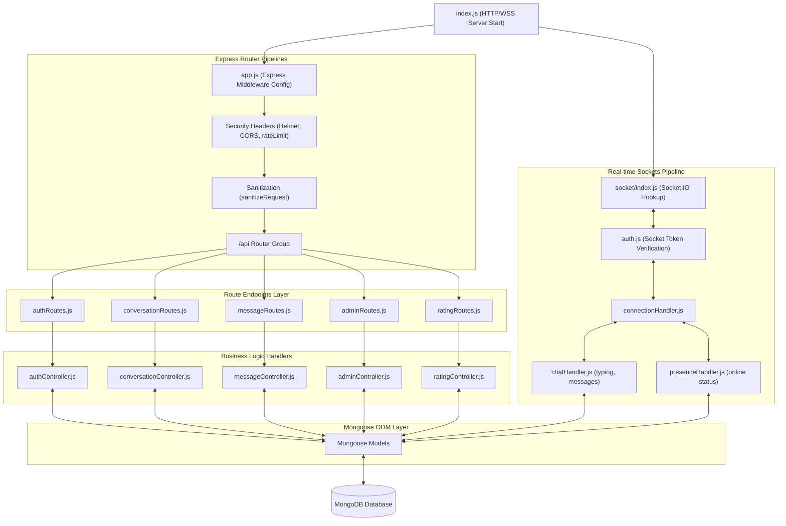

# Backend API & Socket Architecture
**Project:** Real-time Support Chat (SupaNova AI)  
**Organization:** Codtech IT Solutions Private Limited  
**Intern:** Naguru Suhas (ID: CITS1993)  

This document visualizes the controller architecture, route handling, and WebSockets setup of the Express server.

