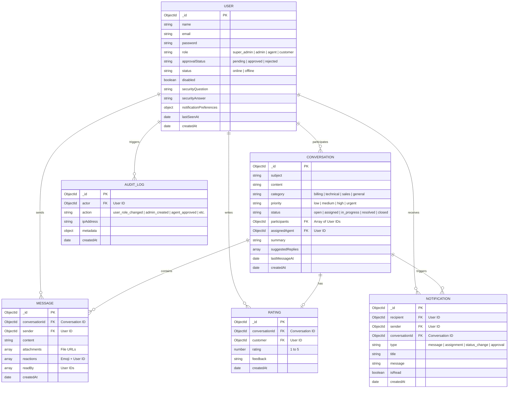

# Database Design & Entity Relationship Diagram (ERD)
**Project:** Real-time Support Chat (SupaNova AI)  
**Organization:** Codtech IT Solutions Private Limited  
**Intern:** Naguru Suhas (ID: CITS1993)  

This document describes the schema architecture and reference-based relationships within the MongoDB collections.

