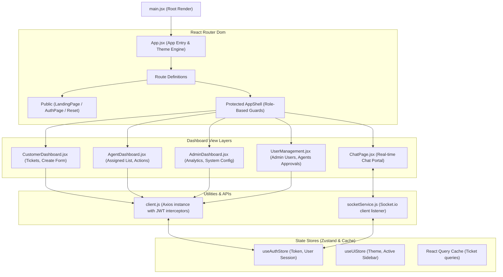

# Frontend Component Architecture
**Project:** Real-time Support Chat (SupaNova AI)  
**Organization:** Codtech IT Solutions Private Limited  
**Intern:** Naguru Suhas (ID: CITS1993)  

This document visualizes the internal structural flow and React components architecture of the client application.

