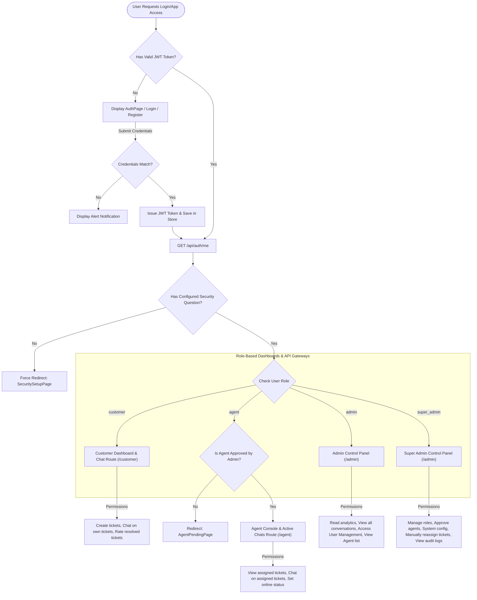

# Authentication & Role-Based Access Control (RBAC) Flow
**Project:** Real-time Support Chat (SupaNova AI)  
**Organization:** Codtech IT Solutions Private Limited  
**Intern:** Naguru Suhas (ID: CITS1993)  

This document visualizes the user authentication lifecycle and permission routing of the application's RBAC matrix.

