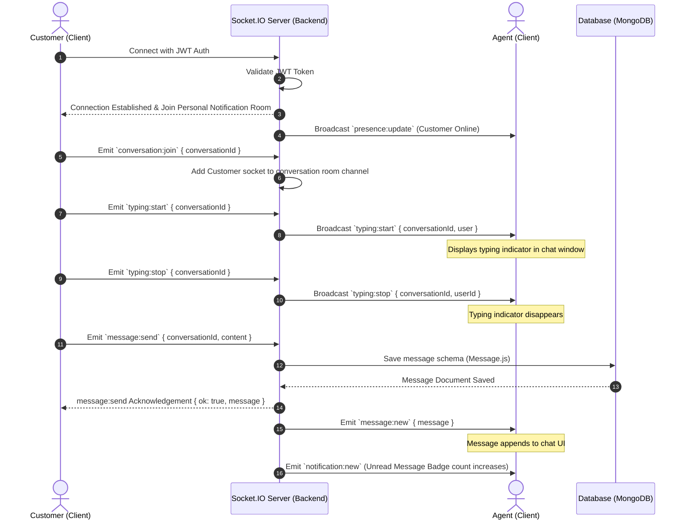

# Socket.IO Real-time Communication lifecycle
**Project:** Real-time Support Chat (SupaNova AI)  
**Organization:** Codtech IT Solutions Private Limited  
**Intern:** Naguru Suhas (ID: CITS1993)  

This document visualizes the real-time event pipeline and message exchange channels established over WebSockets.

